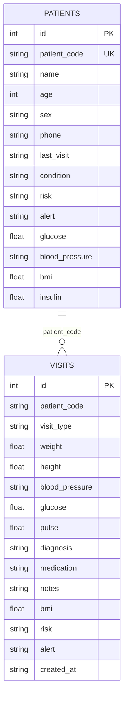

# Database Analysis

## Database Type

The application uses SQLite through SQLAlchemy ORM. The database file is `emr.sqlite3` and is created automatically at startup if it does not already exist.

## Schema Overview

There are two persistent tables:

- `patients`
- `visits`

The schema is intentionally small and application-managed rather than migration-driven.

## Tables

### `patients`

| Column | Type | Constraints | Purpose |
|---|---|---|---|
| `id` | Integer | Primary key, autoincrement | Internal row identifier |
| `patient_code` | String(32) | Unique, not null, indexed | Public patient code used across the app |
| `name` | String(120) | Not null | Patient name |
| `age` | Integer | Not null | Patient age |
| `sex` | String(24) | Not null | Recorded sex |
| `phone` | String(32) | Not null | Contact number |
| `last_visit` | String(32) | Not null | Last visit date as ISO string |
| `condition` | String(120) | Not null | Current or last recorded condition |
| `risk` | String(24) | Not null | Current risk label |
| `alert` | String(255) | Not null | Clinical alert summary |
| `glucose` | Float | Nullable | Latest glucose value |
| `blood_pressure` | String(32) | Nullable | Latest blood pressure reading |
| `bmi` | Float | Nullable | Latest BMI |
| `insulin` | Float | Nullable | Optional patient value used in profile views |

### `visits`

| Column | Type | Constraints | Purpose |
|---|---|---|---|
| `id` | Integer | Primary key, autoincrement | Internal row identifier |
| `patient_code` | String(32) | Indexed, not null | Links a visit to a patient code |
| `visit_type` | String(120) | Not null | Consultation type |
| `weight` | Float | Nullable | Visit measurement |
| `height` | Float | Nullable | Visit measurement |
| `blood_pressure` | String(32) | Nullable | Visit measurement |
| `glucose` | Float | Nullable | Visit measurement |
| `pulse` | Float | Nullable | Visit measurement |
| `diagnosis` | String(120) | Not null | Visit diagnosis |
| `medication` | String(255) | Nullable | Medication text |
| `notes` | Text | Nullable | Free-text clinical notes |
| `bmi` | Float | Nullable | Derived BMI |
| `risk` | String(24) | Not null | Visit risk label |
| `alert` | String(255) | Not null | Visit alert summary |
| `created_at` | String(32) | Not null | Visit date as ISO string |

## Relationships

The relationship between patients and visits is logical and application-managed:

- one patient can have many visits
- the shared key is `patient_code`
- no explicit SQL foreign key constraint is declared in the ORM models

## Indexes

- `patients.patient_code` is indexed and unique
- `visits.patient_code` is indexed

## Constraints

- primary keys on both tables
- `patients.patient_code` is unique and non-null
- most clinical and identity fields are non-null
- visit rows are validated in the application before insertion

## Entity Relationship Diagram

## What Each Table Stores

- `patients` stores the current patient snapshot shown in the dashboard, list, and profile views.
- `visits` stores each recorded consultation and feeds the patient timeline and visit history panels.
