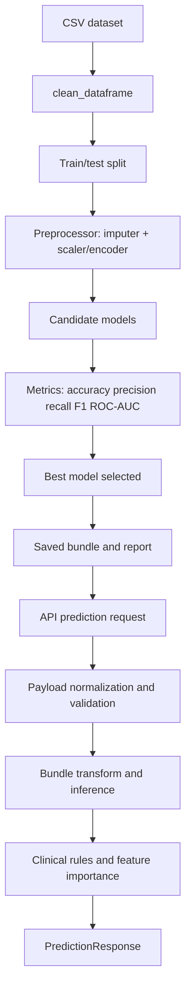

# ML Pipeline Audit

## Datasets Used

| Disease | Dataset file | Rows in saved report | Target column |
|---|---|---:|---|
| Diabetes | `datasets/diabetes_data.csv` | 64,020 | `diabetes` |
| Hypertension | `datasets/hypertension_data.csv` | 26,083 | `target` |
| Stroke | `datasets/stroke_data.csv` | 40,910 | `stroke` |

The repository documentation describes these as real CSV datasets used for training. The training code resolves the file from `backend.config.DISEASE_SPECS` and searches the local dataset paths.

## Why These Datasets Were Chosen

- They are already packaged with the repository.
- They match the three supported prediction endpoints.
- They provide disease-specific feature sets and binary targets for academic demonstration.

## Feature Sets

### Diabetes

Original and transformed features in the saved manifest:

- age
- sex
- highchol
- cholcheck
- bmi
- smoker
- heartdiseaseorattack
- physactivity
- fruits
- veggies
- hvyalcoholconsump
- genhlth
- menthlth
- physhlth
- diffwalk
- stroke
- highbp

### Hypertension

- age
- sex
- cp
- trestbps
- chol
- fbs
- restecg
- thalach
- exang
- oldpeak
- slope
- ca
- thal

### Stroke

- sex
- age
- hypertension
- heart_disease
- ever_married
- work_type
- residence_type
- avg_glucose_level
- bmi
- smoking_status

## Preprocessing

The shared cleaning step in `backend.data_utils.clean_dataframe()`:

- normalizes column names to snake_case
- removes duplicate rows
- replaces infinities with missing values
- coerces common yes/no and true/false values to 0/1 when possible
- fills numeric missing values with the median
- fills categorical missing values with the mode or `unknown`

## Feature Engineering

There is no heavy feature engineering layer. The pipeline intentionally stays simple:

- binary values are normalized
- raw column names are standardized
- the training scripts use the cleaned columns directly
- feature manifests preserve the original feature order for inference

## Scaling and Encoding

- Numeric features are passed through `SimpleImputer(strategy='median')` and `StandardScaler()`
- Categorical features, when present, are passed through `SimpleImputer(strategy='most_frequent')` and `OneHotEncoder(handle_unknown='ignore')`
- In the saved manifests for these datasets, all final features are numeric, so no categorical columns remain in the exported manifests

## Train-Test Split

- `train_test_split(..., test_size=0.2, random_state=42, stratify=target)`

## Missing Values

- Numeric columns: median imputation
- Categorical columns: mode imputation
- Payload validation: inference raises an error if any required model feature is missing

## Handling Imbalance

- The training script computes class imbalance from the training split
- If `imblearn` is installed and the minority class is large enough, SMOTE is applied
- Otherwise, the script uses class weights or sample weights
- `LogisticRegression` and `RandomForestClassifier` are configured with balanced weighting

## Model Selection

Each disease pipeline compares:

- Logistic Regression
- Random Forest
- Gradient Boosting
- XGBoost when available in the environment

The selected model is the one with the best F1 score, then ROC-AUC, then accuracy.

## Evaluation Pipeline

For each candidate model the pipeline calculates:

- accuracy
- precision
- recall
- F1 score
- ROC-AUC
- confusion matrix
- classification report

The full report is saved to `saved_models/*_training_report.json`.

## Saved Artifacts

For each disease the pipeline saves:

- fitted model bundle (`*_model.pkl`)
- numeric scaler (`*_scaler.pkl`)
- feature manifest (`*_feature_names.json`)
- training report (`*_training_report.json`)

## Inference Workflow

1. The API receives a `PredictionRequest` with a feature dictionary.
2. `normalize_payload_keys()` standardizes the keys.
3. `prediction_service._prepare_features()` coerces simple string values and verifies required features.
4. The saved `DiseaseModelBundle` transforms the frame with the fitted preprocessor.
5. The estimator returns a class prediction and probability.
6. `clinical.py` adds risk level, recommendations, preventive measures, and feature importance.
7. The API returns a `PredictionResponse` JSON payload.

