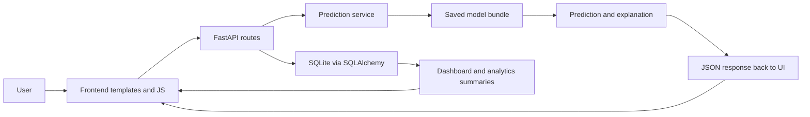

# Project Overview

## Project Summary

- Project title: EMR AI Predictive Analytics System
- Purpose: an electronic medical record prototype that combines patient management, visit recording, analytics, and disease-risk prediction in one FastAPI application.
- Objectives: digitize patient workflows, surface hospital dashboards, provide explainable AI predictions for diabetes, hypertension, and stroke, and keep the system easy to demonstrate as a final-year university project.
- Main features: authentication pages, dashboard, patient registry, visit workflow, AI prediction workbench, analytics page, report exports, and local settings.
- Technology stack: FastAPI, Jinja2 templates, vanilla JavaScript, CSS, SQLAlchemy, SQLite, pandas, NumPy, scikit-learn, joblib, and Uvicorn/Gunicorn.

## Repository Structure

```text
emr-system-with-predictive-analytics/
├── app.py
├── main.py
├── train_models.py
├── requirements.txt
├── README.md
├── DEFENSE_GUIDE.md
├── MODEL_EVALUATION.md
├── FUNCTIONAL_TEST_REPORT.md
├── API_TEST_REPORT.md
├── PROJECT_AUDIT.md
├── FINAL_PROJECT_REPORT.md
├── CODE_REVIEW.md
├── UI_IMPROVEMENTS.md
├── implementation_notes.md
├── backend/
│   ├── __init__.py
│   ├── config.py
│   ├── data_utils.py
│   ├── database.py
│   ├── model_bundle.py
│   ├── prediction_service.py
│   ├── schemas.py
│   ├── clinical.py
│   └── training.py
├── datasets/
│   ├── diabetes_data.csv
│   ├── hypertension_data.csv
│   └── stroke_data.csv
├── saved_models/
│   ├── diabetes_model.pkl
│   ├── diabetes_scaler.pkl
│   ├── diabetes_feature_names.json
│   ├── diabetes_training_report.json
│   ├── hypertension_model.pkl
│   ├── hypertension_scaler.pkl
│   ├── hypertension_feature_names.json
│   ├── hypertension_training_report.json
│   ├── stroke_model.pkl
│   ├── stroke_scaler.pkl
│   ├── stroke_feature_names.json
│   └── stroke_training_report.json
├── static/
│   ├── auth.js
│   ├── script.js
│   └── style.css
└── templates/
    ├── auth_base.html
    ├── forgot_password.html
    ├── index.html
    ├── login.html
    ├── logout.html
    ├── profile.html
    ├── register.html
    ├── reset_password.html
    └── result.html
```

## File Inventory

| File | Purpose | Responsibilities | Dependencies | Fit in system |
|---|---|---|---|---|
| `main.py` | FastAPI application entrypoint | Defines UI routes, API routes, prediction routes, bootstrap data, and error handling | `backend.database`, `backend.prediction_service`, `backend.schemas`, FastAPI | Central server wiring for the whole app |
| `app.py` | Compatibility wrapper | Re-exports `app` for older entry points | `main.py` | Keeps legacy startup compatibility |
| `backend/config.py` | Central config | Paths, disease specs, model file names, database URL | `pathlib`, `os`, dataclasses | Shared configuration for training and inference |
| `backend/database.py` | Database layer | SQLAlchemy models, seeding, patient CRUD, visit storage, dashboard/analytics summaries | SQLAlchemy, SQLite | Source of patient and operational data |
| `backend/data_utils.py` | Data cleaning helpers | Column normalization, binary coercion, missing-value handling | pandas, NumPy | Shared preprocessing for training and inference payloads |
| `backend/training.py` | ML training pipeline | Loads datasets, cleans data, splits data, trains models, evaluates, saves artifacts | scikit-learn, joblib, pandas, optional imblearn/xgboost | Builds the disease-specific model bundles |
| `backend/prediction_service.py` | Inference service | Loads saved bundles, validates payloads, predicts risk, returns explainability | joblib, pandas, clinical helpers | Executes live prediction endpoints |
| `backend/model_bundle.py` | Serializable model bundle | Stores preprocessing and estimator together | pandas, NumPy | Makes inference portable and repeatable |
| `backend/clinical.py` | Clinical rules and explanations | Recommendation rules, preventive advice, feature importance extraction | Python stdlib | Adds explainable clinical guidance |
| `backend/schemas.py` | API schemas | Request and response validation for patients, visits, predictions | Pydantic | Enforces contract at API boundary |
| `datasets/*.csv` | Training data | Real disease datasets used for model training | pandas | Training source data |
| `saved_models/*.pkl/json` | Model artifacts | Bundles, scalers, feature manifests, training reports | joblib, JSON | Persisted inference assets |
| `templates/index.html` | Main EMR shell | Dashboard, patients, visit, analytics, reports, settings, AI prediction pages | Jinja2, frontend JS/CSS | Main hospital UI shell |
| `templates/*.html` | Auth and result pages | Login, register, reset, profile, logout, prediction result | Jinja2 | Support pages outside the shell |
| `static/script.js` | Frontend controller | Page rendering, local state, CRUD actions, prediction UI, report exports | Browser APIs, fetch | Drives the SPA-like experience |
| `static/auth.js` | Mock auth client | LocalStorage session management and auth page behavior | Browser APIs | Implements client-side authentication demo |
| `static/style.css` | Global styles | Full visual design system and responsive rules | CSS only | Controls UI layout and presentation |
| `README.md` | Project guide | Setup and feature summary | none | High-level project documentation |
| `MODEL_EVALUATION.md` | ML summary | Model metrics overview | training reports | Human-readable model evaluation summary |
| `API_TEST_REPORT.md` | API QA summary | Route and API verification notes | app tests | API validation record |
| `FUNCTIONAL_TEST_REPORT.md` | Functional QA summary | Workflow test notes | app tests | Functional validation record |
| `PROJECT_AUDIT.md` | Prior audit notes | Review findings and project state | repo docs | Historical audit reference |
| `FINAL_PROJECT_REPORT.md` | Final project summary | Summary of completed project state | repo docs | Final presentation support |
| `DEFENSE_GUIDE.md` | Defense prep | Short answers and technical framing | repo docs | Oral defense support |
| `UI_IMPROVEMENTS.md` | UI change log | Records frontend module upgrades | repo files | Change history for UI work |

## External Libraries

| Dependency | Why it exists |
|---|---|
| `fastapi` | Web framework for routes, validation, and automatic API docs |
| `jinja2` | Server-side template rendering for the HTML pages |
| `python-multipart` | Form handling support for template-backed pages |
| `sqlalchemy` | Database ORM and schema management |
| `uvicorn` | ASGI server used to run the app locally and in deployment |
| `numpy` | Numeric support for preprocessing and model training |
| `pandas` | CSV loading, cleaning, feature manipulation, and reporting |
| `scikit-learn` | Model training, preprocessing, metrics, and pipelines |
| `joblib` | Saving and loading fitted model bundles |
| `gunicorn` | Production process manager for deployment |

Optional imports are referenced in code but not required by `requirements.txt`:

- `imblearn` for SMOTE-based resampling when available
- `xgboost` for an extra candidate classifier when available

## Application Flow

User -> Frontend -> API -> Database -> Machine Learning -> Prediction -> Response


